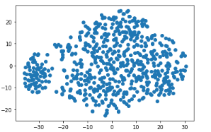
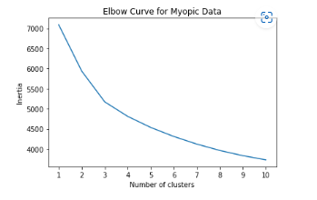
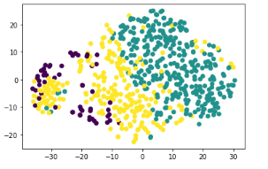

# unsupervised-machine-learning

## Overview 

In this repository, unsupervised machine learning was used to improve a classification model used to preditc myopia for a medical reasearch company.  Jupyter Notebook was used to prepare, scale, cluster, and ultimately make a recommendation based on the results produced. 

## Apply Dimensionality Reduction

The data was further reduced with t-SNE and visually inspected in the form of a scatter plot. There are two distinct clusters displayed on the graph. 

## Perform a Cluster Analysis with K-means

An elbow plot was created to identify the best number of clusters. The value of k appears at 3 on the elbow plot. 

## Recommendation

Patients can be clustered to determine their relationship with the data provided. The K-means analysis determines that three cluster groups would best represent this data. 

